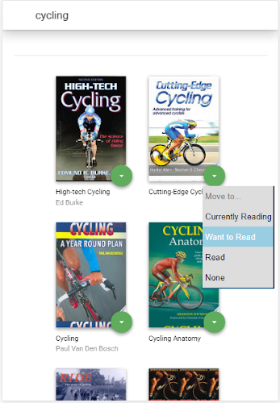

# MyReads: A Book Tracking App
The project of the Front-End Web Developer Nanodegree with Udacity course. The main goal of this project is to learn React fundamentals.
## How it works
This application has 2 pages. The main page contains bookshelves. Books can be shuffled between shelves. The next page allows a book search by the chosen term.
All search terms are specified in [Search Terms file](https://github.com/pressR2/MyReads/blob/master/SEARCH_TERMS.md).
   
## How to run
* To get started clone [repository](https://github.com/pressR2/MyReads.git)
* Install all project dependencies with `npm install`
* Start the development server with `npm start`
## Source
Initial code by Udacity [link](https://github.com/udacity/reactnd-project-myreads-starter).
### Requirements
[Node.js](https://nodejs.org)